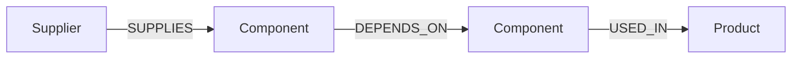

# Supply Chain Risk Analyzer

A Next.js application backed by CognoDB (Neo4j) for visualizing and simulating risk across a multi-tier global supply chain.

**Live Demo:** [Insert your hosted demo link here]
**Demo Video:** [Insert your Loom or screen recording link here]

---

## 1. The Use Case: Why a Graph Database?

Modern supply chains are highly interconnected. A finished product may depend on a sub-assembly, which depends on a component, which is sourced from a specific supplier.

### The Relational Database Problem

In a traditional SQL database, calculating the **"blast radius"** of a supplier going bankrupt requires traversing an unknown number of dependencies.

This typically requires complex and computationally expensive **Recursive Common Table Expressions (CTEs)**. Furthermore, detecting structural bottlenecks — for example, a component deep in the supply chain that is supplied by only one vendor — can require numerous `JOIN` operations across self-referencing tables.

### The Graph Database Advantage

Supply chains are naturally represented as graphs.

By modeling **Suppliers, Components, and Products** as nodes, and their dependencies as relationships, we can use openCypher to traverse the supply chain across multiple levels.

For example, finding the multi-tier blast radius of a failed supplier can be expressed using a variable-length path query such as `*1..5`.

This makes the queries easier to understand and maintain while providing an efficient way to explore complex dependency networks as the supply chain grows.

---

## 2. Data Model

The graph consists of three node labels and three relationship types:



### Nodes

* `(:Supplier)` — e.g., **Apex Microchips**
  * Properties: `id`, `name`, `region`, `reliabilityScore`
* `(:Component)` — e.g., **Transistor Array**
  * Properties: `id`, `name`, `type`
* `(:Product)` — e.g., **Enterprise Server X1**
  * Properties: `id`, `name`, `category`

### Relationships

* `[:SUPPLIES]` — Connects a supplier to a component.
  * Properties: `leadTimeDays`, `cost`
* `[:DEPENDS_ON]` — Represents a component or sub-assembly dependency.
  * Properties: `quantity`
* `[:USED_IN]` — Connects a component to a final product.
  * Properties: `quantity`

---

## 3. Core Cypher Queries

### A. Multi-Hop Traversal — Blast Radius

This query simulates a supplier failure and traverses the graph up to five levels deep to identify affected end products.

```cypher
MATCH (s:Supplier {id: $supplierId})
      -[:SUPPLIES]->(c:Component)
      -[:DEPENDS_ON|USED_IN*1..5]->(p:Product)
RETURN DISTINCT
    p.id AS productId,
    p.name AS productName,
    p.category AS category
```

### B. Structural Bottleneck — Difficult in SQL

This query identifies components that are globally sourced from exactly one supplier and traces their dependencies to affected products.

```cypher
MATCH (c:Component)
WHERE COUNT { (s:Supplier)-[:SUPPLIES]->(c) } = 1
MATCH (c)-[:DEPENDS_ON|USED_IN*1..5]->(p:Product)
RETURN
    c.name AS bottleneckComponent,
    p.name AS affectedProduct
```

---

## 4. Setup & Installation

### A. Set Up CognoDB Cloud

1. Create a free account at [CognoDB Console](https://console.cognodb.com).

2. Provision a free `c0` instance in your preferred region.

3. Save the generated `bolt+s://` URI and the password for the `cognodb` user.

### B. Run the Application

Clone this repository and install the dependencies:

```bash
npm install
```

Create a `.env.local` file in the root directory:

```env
NEO4J_URI=bolt+s://<your-instance-id>.databases.cognodb.cloud
NEO4J_USER=cognodb
NEO4J_PASSWORD=<your-saved-password>
```

> **Important:** Never commit `.env.local` or your database password to GitHub.

Seed the graph database with the sample data:

```bash
npx tsx scripts/seed.ts
```

Then start the Next.js development server:

```bash
npm run dev
```

Open the application in your browser at:

```text
http://localhost:3000
```

---

## 5. UI Screenshots

> Replace the placeholders below with screenshots of your running application.

### Main Dashboard

The main dashboard provides the simulation controls and displays currently identified supply-chain bottlenecks.


### Blast Radius Simulation

The blast radius view shows the products and downstream components affected by simulating the failure of a supplier.


---

## 6. Key Features

* **Multi-tier dependency visualization**
* **Supplier failure simulation**
* **Blast radius analysis**
* **Structural bottleneck detection**
* **Graph-based supply chain traversal**
* **Cypher-powered risk analysis**
* **Interactive Next.js dashboard**

---

## 7. Technology Stack

* **Frontend:** Next.js
* **Database:** CognoDB / Neo4j
* **Query Language:** openCypher
* **Runtime:** Node.js
* **Data Seeding:** `tsx`

---

## 8. Project Structure

```text
.
├── src/
│   ├── app/                # Next.js application & API routes
│   └── lib/                # Neo4j database driver setup
├── scripts/
│   └── seed.ts             # Sample graph data
├── public/
│   └── screenshots/        # UI screenshots
├── .env.local              # Local environment variables
├── package.json
└── README.md
```

---

## 9. Why This Matters

Supply-chain risk is fundamentally a **network problem**.

A single supplier can impact multiple components, which can affect sub-assemblies, which can ultimately impact multiple finished products.

A graph database makes these relationships explicit and enables the application to answer questions such as:

* Which products are affected if a supplier fails?
* How many tiers downstream are impacted?
* Which components have only one supplier?
* Which products depend on a potentially critical component?
* Where are the most significant structural bottlenecks?

By modeling these dependencies as a graph, complex supply-chain risk analysis becomes a natural graph traversal problem rather than a collection of increasingly complex relational queries.
